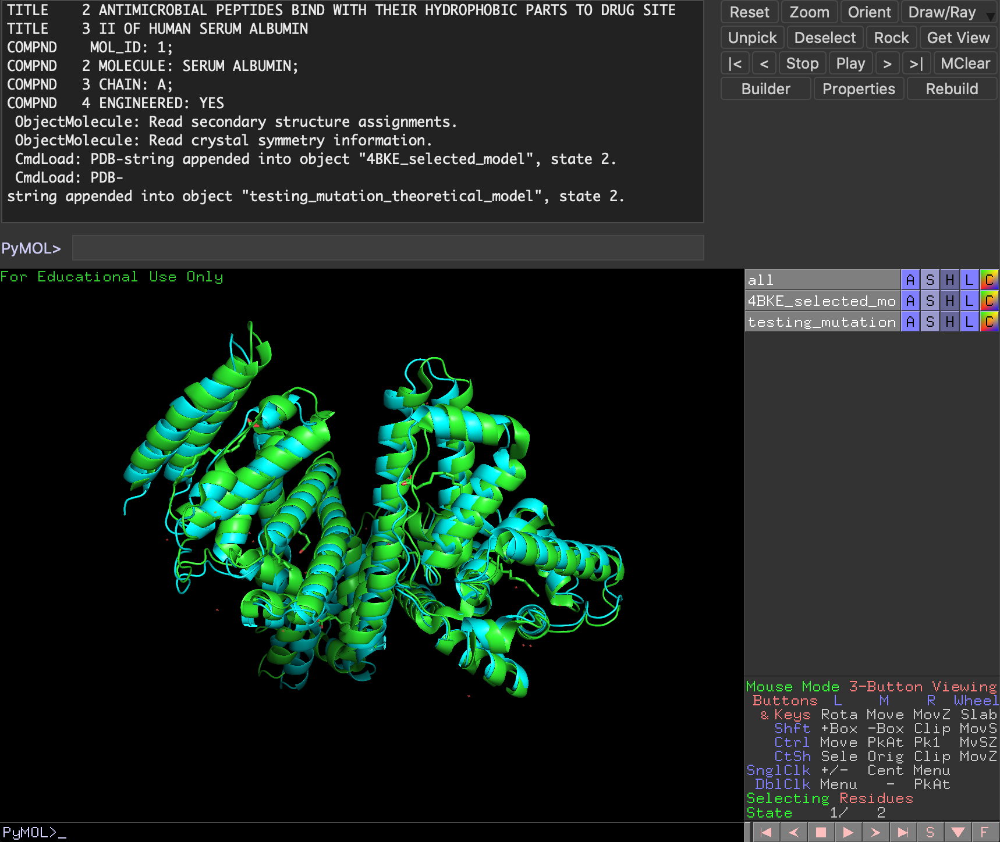

# Mutaviz

This program allows a user to mutate a dna, rna or protein, synthesize a protein and model that protein.
For that we are using: BLAST and Modeller.
The work flow is:
  - The user call the program with a .fasta with the dna/rna/protein, the position where the coding dna/rna/protein of the desired protein start (index starts at 1), the desired mutations and the desired parameters for blast.
The program steps are:
  - synthesizes the protein from the dna/rna/protein
  - performs a BLAST query with the passed parameters and the synthesized protein
  - searches on the blast result the best match for the searched protein. The best match will be calculated by > % of identity and < evalue. In this case we have two options.
    - finds a result that match exactly with the searched protein, this means that the percentage of identity is more or equals percentage of identity than 99%.
      - mutates the passed dna/rna and synthesize the protein.
      - aligns the mutated protein sequence with the pdb find in the blast result, using modeller
      - creates the theoretical protein structure using the alignment and the PDB model 
    - The searched protein does not have a exact match in the blast, so the program selects the best match (bases on identity and evalue).
      - aligns the protein sequence with the pdb selected in the blast result, using modeller
      - creates a theoretical protein structure using the alignment and the pdb model
      - mutates the passed dna/rna and synthesize the protein.
      - aligns the mutated protein sequence with the theoretical model, using modeller
      - creates the mutated theoretical protein structure using the alignment and the pdb model

### Program assumptions
- Best BLAST match will be given by **> % of identity** and **< evalue** of the query result
- Best theoretical model is given by the greater DOPE score of all the returning models

## Setup

### Create conda env
`conda env create -f environment.yml`

If this command does not work, install dependencies manually:

`conda env create -n mutaviz python3.7 biopython=1.74 pymol=2.3.4 modeller=9.23 blas=1.0 pytest=5.2`

Channels for deps are bioconda, salilab and schrodinger

### Update conda env
`conda env update -n mutaviz --file environment.yml  --prune`

### Activate conda env
`conda activate mutaviz`

### Deactivate conda env
`conda deactivate`

### Set modeller key in
`<where is conda installed>/envs/mutaviz/lib/modeller-9.23/modlib/modeller/config.py`

## Usage

### Bash command line
For options run `python main.py --help`, you will see usage help

```
usage: main.py [-h] [--fasta FASTA] [--gap-costs GAP_COSTS]
               [--matrix-name MATRIX_NAME] [--mutations MUTATIONS]
               [--name NAME] [--open-pymol OPEN_PYMOL] [--seq-end SEQ_END]
               [--seq-start SEQ_START] [--seq-type SEQ_TYPE]
               [--threshold THRESHOLD] [--word-size WORD_SIZE]

optional arguments:
  -h, --help            show this help message and exit
  --fasta FASTA         Path of the Fasta file containing the problem sequence
  --gap-costs GAP_COSTS
                        BLAST gap costs, first existence and then extension.
                        Default: '11 1'
  --matrix-name MATRIX_NAME
                        BLAST matrix name. Default: BLOSUM62
  --mutations MUTATIONS
                        Path of the mutations file, format must be a json with
                        index and mutation i.e. {10: "A"}
  --name NAME           Name of the program run
  --open-pymol OPEN_PYMOL
                        If true, opens PyMOL with both PDB files. Default
                        false
  --seq-end SEQ_END     Ending position of the given sequence. You can use
                        GenBank info
  --seq-start SEQ_START
                        Starting position of the given sequence (starts at 1).
                        You can use GenBank info
  --seq-type SEQ_TYPE   Type of the fasta sequence (DNA, RNA or PROTEIN).
                        Default: DNA
  --threshold THRESHOLD
                        BLAST threshold. Default: 10
  --word-size WORD_SIZE
                        BLAST word size. Default: 6
```

#### Usage example
`python main.py --fasta=mutaviz/human_serum_albumin_dna.fasta --seq-start=111 --seq-end=1871 --mutations=mutations.json --name='testing' --gap-costs='11 1' --seq-type=DNA --open-pymol=true`

### Importing it as a Python module
```python
from mutaviz.models.mutaviz import Mutaviz

seq = ... # A String containing dna, arn or protein chain
mutations_dict = ... # A dict containing mutations for mutating the original sequence. i.e. {50: 'C'},
                     # where 50 is the position in the sequence and 'C' is the aminoacid you want to use.
mutaviz = Mutaviz(seq=seq, mutations=mutations_dict, seq_name="testing", seq_type="DNA")
mutaviz.process(word_size=6, threshold=10, matrix_name="BLOSUM62", gap_costs="11 1", open_pymol=False)
```

### Output
The output of the program will be by default in the output folder where the program is running, if you set the output parameter the program will store all the output files there.
If the synthesized protein exists (the program find a result with 100% of identity) the output will be:
  - PDB model: <pdb key>_selected_model.pdb this file is the pdb the program find with a 100% of identity in the blast result
  - Alignment with model: mutated_<seq_name>_<pdb key>_alignment.pir this file is the aligment of the mutated protein and the pdb that the program find in the blast.
  - Modeled PDB: <seq_name>__mutation_theoretical_model.pdb this is the result of modeling with the aligment and the pdb model.
If the synthesized protein does not exist, the program will select the best match for the searched protein. In that case the output will be:
  - PDB model: <pdb key>_selected_model.pdb this file is the pdb the program select as best match.
  - Alignment with model: model_<seq_name>_<pdb key>_alignment.pir this file is the aligment of the protein sequence and the pdb that the program find in the blast.
  - Modeled PDB<seq_name>_theoretical_model this is the result of modeling with the aligment and the pdb model.
  - Alignment with modeled pdb: mutated_<seq_name>_alignment.pir this file is the aligment of the mutated protein and the pdb model.
  - Modeled PDB: <seq_name>__mutation_theoretical_model.pdb this is the result of modeling with the aligment and the pdb modeled.

### Pymol outputs
When PyMOL flag is true, PyMOL will be execute and you will see something like


Otherwise you will get a png of the alignment on the outputs file, i.e.:


### Logging
Mutaviz will print execution steps on the shell and you can also check logs.log file to check all logs whenever you need to (during and after execution).